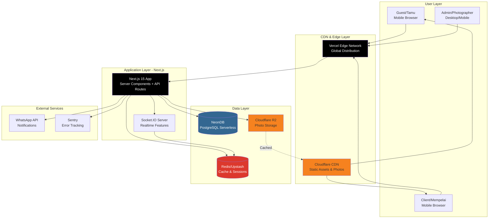

# Hafiportrait Photography Platform - Arsitektur Fullstack

**Version:** 2.0 - Next.js 15 Fullstack  
**Date:** December 2024  
**Status:** Updated  
**Author:** Architecture Team

---

## Table of Contents

1. [Introduction](#introduction)
2. [High Level Architecture](#high-level-architecture)
3. [Tech Stack](#tech-stack)
4. [Data Models](#data-models)
5. [Database Schema](#database-schema)
6. [API Specification](#api-specification)
7. [Frontend Architecture](#frontend-architecture)
8. [Realtime Features](#realtime-features)
9. [Authentication & Authorization](#authentication--authorization)
10. [Storage Architecture](#storage-architecture)
11. [Development Setup](#development-setup)
12. [Deployment Architecture](#deployment-architecture)
13. [Security & Performance](#security--performance)
14. [Testing Strategy](#testing-strategy)
15. [Monitoring & Observability](#monitoring--observability)

---

## Introduction

Dokumen ini menjelaskan arsitektur teknis lengkap untuk Hafiportrait Photography Platform, sebuah platform galeri foto pernikahan mobile-first yang dirancang untuk memberikan akses instan kepada tamu undangan, workflow yang efisien untuk fotografer, dan pengalaman yang memberdayakan klien.

### Major Architecture Update (v2.0)

**Key Changes:**
- ✅ **Single Fullstack Framework:** Next.js 15.5.9 dengan App Router (previously: separate React + Express)
- ✅ **Serverless Database:** NeonDB PostgreSQL (previously: self-hosted/managed PostgreSQL)
- ✅ **Realtime Features:** Socket.IO integration untuk live comments, likes, notifications
- ✅ **Dual Deployment:** VPS untuk development, Vercel untuk production
- ✅ **Public Development:** VPS dengan public IP untuk mobile testing dan webhooks

Arsitektur ini mengadopsi pendekatan **Next.js fullstack modern** dengan fokus pada:
- **Mobile-First Performance**: Optimasi khusus untuk perangkat mobile Android/iOS
- **Scalability**: Serverless auto-scaling untuk mendukung growth
- **High Availability**: Vercel edge network dengan 99.99% uptime
- **Security**: Multi-layer security untuk melindungi data dan aset foto
- **Developer Experience**: Unified codebase dengan excellent DX
- **Cost Efficiency**: Serverless pay-per-use untuk optimal costs

### Change Log

| Date | Version | Description | Author |
|------|---------|-------------|--------|
| Dec 2024 | 1.0 | Initial architecture document | Architecture Team |
| Dec 2024 | 2.0 | **Major update:** Next.js 15 fullstack, NeonDB, Socket.IO, Vercel deployment | Architecture Team |

---

## High Level Architecture

### Technical Summary

Hafiportrait Photography Platform mengadopsi **Next.js 15 fullstack architecture** dengan **App Router**, unified frontend dan backend dalam single codebase. Platform menggunakan **NeonDB (PostgreSQL Serverless)** untuk database dengan auto-scaling dan built-in connection pooling, **Cloudflare R2** untuk photo storage dengan zero egress costs, dan **Socket.IO** untuk realtime features.

Arsitektur dirancang sebagai **serverless-first dengan managed services**, optimal untuk Vercel deployment dengan automatic scaling. Development environment menggunakan VPS dengan public IP untuk mobile testing dan webhook integrations. Background jobs dihandle oleh **Next.js API routes** dengan scheduled functions.

**Key Architecture Decisions:**
- **Next.js 15 over separate React + Express:** Unified codebase, automatic optimizations, better DX
- **NeonDB over traditional PostgreSQL:** Serverless, auto-scaling, pay-per-use, Vercel-native
- **Vercel over VM deployment:** Zero-config, global CDN, automatic HTTPS, instant scaling
- **Socket.IO for realtime:** Reliability, features, battle-tested in production
- **VPS for development:** Public access for mobile testing, webhook testing, client demos

### Platform and Infrastructure Choice

#### Selected: Dual Environment Strategy

**Development Environment: VPS with Public IP**
- **Purpose:** Development, testing, client demos
- **Platform:** DigitalOcean/Hetzner VPS
- **Specs:** 2 vCPU, 4GB RAM, 80GB SSD
- **Cost:** ~$24-36/month
- **Benefits:**
  - Public URL untuk mobile device testing
  - WhatsApp webhook testing
  - Client demos tanpa VPN
  - Real network condition testing

**Production Environment: Vercel**
- **Purpose:** Live production deployment
- **Platform:** Vercel (Next.js native)
- **Cost:** $20/month + usage
- **Benefits:**
  - Zero-config deployment
  - Global edge network (20+ regions)
  - Automatic HTTPS dan scaling
  - Built-in analytics
  - Preview deployments per PR
  - Instant rollbacks

**Rationale:**
1. **Best of Both Worlds:** VPS flexibility untuk development + Vercel performance untuk production
2. **Cost Effective:** Pay only untuk what you use in production
3. **Developer Experience:** Public dev environment + zero-config production
4. **Scalability:** Serverless auto-scaling in production
5. **Reliability:** 99.99% uptime SLA dengan Vercel

### Repository Structure

**Structure:** Single Next.js application (monolith)

```
hafiportrait/
├── app/                        # Next.js App Router
│   ├── (auth)/                # Auth route group
│   │   ├── login/
│   │   └── layout.tsx
│   ├── (public)/              # Public route group
│   │   ├── [slug]/           # Event galleries
│   │   └── portfolio/
│   ├── admin/                 # Admin dashboard
│   │   ├── events/
│   │   ├── photos/
│   │   └── analytics/
│   ├── client/                # Client dashboard
│   ├── api/                   # API Routes
│   │   ├── auth/
│   │   ├── events/
│   │   ├── photos/
│   │   ├── socket/           # Socket.IO
│   │   └── webhooks/
│   ├── layout.tsx            # Root layout
│   └── page.tsx              # Homepage
├── components/                # React components
│   ├── ui/                   # Base components
│   ├── features/             # Feature components
│   └── layouts/
├── lib/                      # Utilities
│   ├── prisma.ts
│   ├── redis.ts
│   ├── r2.ts
│   ├── socket.ts
│   └── auth.ts
├── hooks/                    # Custom hooks
├── stores/                   # Zustand stores
├── types/                    # TypeScript types
├── prisma/                   # Database schema
│   ├── schema.prisma
│   └── migrations/
├── public/                   # Static assets
├── docs/                     # Documentation
├── .github/                  # CI/CD workflows
├── next.config.js
├── tailwind.config.js
├── tsconfig.json
└── package.json
```

**Rationale:**
- **Single Codebase:** Simplified development, deployment, and maintenance
- **Type Safety:** End-to-end TypeScript tanpa complex monorepo setup
- **Clear Structure:** Feature-based organization dengan clear separation
- **Next.js Native:** Optimal untuk Vercel deployment

### High Level Architecture Diagram



### Architectural Patterns

Berikut adalah pattern-pattern yang akan digunakan dalam development:

- **Next.js App Router:** File-based routing dengan React Server Components - _Rationale:_ Modern Next.js architecture, optimal performance, automatic code splitting

- **API Routes (Route Handlers):** RESTful API dalam `/app/api` - _Rationale:_ Collocated dengan frontend, type sharing, unified deployment

- **Server Components by Default:** React Server Components untuk data fetching - _Rationale:_ Reduced client JavaScript, faster initial loads, better SEO

- **Client Components when needed:** Interactive components dengan `'use client'` - _Rationale:_ Clear separation, optimal bundle sizes

- **Socket.IO for Realtime:** WebSocket communication untuk live features - _Rationale:_ Reliable, fallback support, room management

- **Prisma ORM:** Type-safe database access - _Rationale:_ Excellent TypeScript integration, migrations, great DX

- **Zustand + TanStack Query:** Client state + Server state management - _Rationale:_ Lightweight, React hooks-based, automatic caching

- **Component-Based UI:** React components dengan composition pattern - _Rationale:_ Reusability, maintainability, React best practices

---

## Tech Stack

See detailed tech stack documentation: [Tech Stack](./architecture/tech-stack.md)

**Core Technologies:**

| Category | Technology | Version | Purpose |
|----------|-----------|---------|---------|
| **Fullstack Framework** | Next.js | 15.5.9 | React framework dengan App Router + API Routes |
| **Language** | TypeScript | 5.3+ | Type-safe JavaScript development |
| **Database** | NeonDB (PostgreSQL) | 15+ | Serverless PostgreSQL database |
| **ORM** | Prisma | 5.7+ | Type-safe database client |
| **Realtime** | Socket.IO | 4.7+ | WebSocket communication |
| **Cache** | Redis/Upstash | 7.2+ | In-memory cache & sessions |
| **Storage** | Cloudflare R2 | S3-Compatible | Object storage for photos |
| **CDN** | Cloudflare CDN | Latest | Content delivery network |
| **Image Processing** | Sharp | 0.33+ | High-performance image processing |
| **Authentication** | NextAuth.js | 4.24+ | Authentication for Next.js |
| **Styling** | Tailwind CSS | 3.4+ | Utility-first CSS framework |
| **State Management** | Zustand + TanStack Query | Latest | Client state + Server state |
| **Form Handling** | React Hook Form + Zod | Latest | Form validation & management |
| **Deployment (Dev)** | VPS with Public IP | Ubuntu 22.04 | Development server |
| **Deployment (Prod)** | Vercel | Latest | Production hosting |
| **CI/CD** | GitHub Actions | Latest | Continuous integration & deployment |

**Major Changes from v1.0:**
- ✅ **Single Framework:** Next.js replaces React + Vite + Express
- ✅ **Serverless Database:** NeonDB replaces self-hosted PostgreSQL
- ✅ **Realtime Added:** Socket.IO integration
- ✅ **Dual Deployment:** VPS (dev) + Vercel (prod)
- ✅ **NextAuth:** Replaces custom JWT implementation

---

## Data Models

See detailed database documentation: [Database Schema](./architecture/database.md)

**Core Entities:**
1. **User** - Admin/Photographer dan Client/Mempelai
2. **Event** - Wedding event dengan photos dan settings
3. **Photo** - Photo metadata (files in Cloudflare R2)
4. **PhotoLike** - Guest likes (anonymous)
5. **Comment** - Comments/ucapan dari guests
6. **EditingRequest** - Client editing requests
7. **GuestSession** - Anonymous guest sessions
8. **EventAnalytics** - Aggregated analytics
9. **PhotoDownload** - Download tracking
10. **PortfolioPhoto** - Public portfolio

**Database:** NeonDB (PostgreSQL Serverless)
- Auto-scaling based on load
- Built-in connection pooling
- Database branching for dev/staging
- Point-in-time recovery

---

## Database Schema

See detailed schema: [Database Schema](./architecture/database.md)

**Prisma Schema Highlights:**

```prisma
datasource db {
  provider  = "postgresql"
  url       = env("DATABASE_URL")
  directUrl = env("DIRECT_URL")
}

model Event {
  id                String       @id @default(uuid())
  slug              String       @unique
  title             String
  eventDate         DateTime
  accessCode        String       @unique
  status            EventStatus  @default(ACTIVE)
  allowComments     Boolean      @default(true)
  requireModeration Boolean      @default(true)
  // ... relations
}

model Photo {
  id           String   @id @default(uuid())
  eventId      String
  storageKey   String   @unique
  thumbnailKey String
  // ... metadata
}
```

**Key Features:**
- UUID primary keys
- Proper indexing untuk performance
- Cascade deletes untuk data integrity
- JSONB untuk flexible metadata
- Optimized for NeonDB serverless

---

## API Specification

See detailed API docs: [API Specification](./architecture/api-specification.md)

**API Structure:** Next.js API Routes (Route Handlers)

```
app/api/
├── auth/[...nextauth]/route.ts    # NextAuth endpoints
├── events/
│   ├── route.ts                   # GET, POST /api/events
│   └── [id]/route.ts             # GET, PUT, DELETE /api/events/[id]
├── photos/
│   ├── upload/route.ts           # POST /api/photos/upload
│   └── [id]/
│       ├── like/route.ts         # POST, DELETE /api/photos/[id]/like
│       └── comments/route.ts     # GET, POST /api/photos/[id]/comments
├── socket/route.ts                # Socket.IO endpoint
└── health/route.ts                # GET /api/health
```

**Key Features:**
- **NextAuth.js:** Built-in authentication
- **Type-Safe:** Full TypeScript support
- **Middleware:** Authentication, rate limiting
- **Error Handling:** Standardized error responses
- **Validation:** Zod schema validation

---

## Frontend Architecture

See detailed frontend docs: [Frontend Architecture](./architecture/frontend.md)

**Next.js App Router Structure:**

- **Server Components (Default):** Data fetching, static content
- **Client Components (`'use client'`):** Interactive UI, forms, realtime
- **Route Groups:** (auth), (public), admin, client
- **Parallel Routes:** Modal intercepts untuk photo detail
- **Loading & Error States:** Suspense boundaries, error boundaries

**State Management:**
- **Server State:** TanStack Query (API data, caching)
- **Client State:** Zustand (UI state, preferences)
- **Form State:** React Hook Form (form handling)

**Mobile-First:**
- Tailwind CSS responsive utilities
- Touch gestures (swipe navigation)
- Progressive image loading
- Optimized for 3G/4G networks

---

## Realtime Features

See detailed realtime docs: [Realtime Architecture](./architecture/realtime.md)

**Socket.IO Integration:**

```typescript
// Client-side hook
const { socket, isConnected } = useSocket();

// Join event room
socket.emit('join:event', eventSlug);

// Listen for updates
socket.on('photo:liked', (data) => {
  // Update UI
});
```

**Features:**
- ✅ **Live Likes:** Instant heart animations
- ✅ **Live Comments:** Real-time comment posting
- ✅ **Admin Notifications:** New comment alerts
- ✅ **Room-based Isolation:** Per-event rooms
- ✅ **Fallback Support:** WebSocket → Polling

**Implementation:**
- Custom Next.js API route untuk Socket.IO server
- Redis pub/sub untuk horizontal scaling
- Authentication middleware
- Rate limiting per socket

---

## Authentication & Authorization

See detailed security docs: [Authentication & Security](./architecture/auth-security.md)

**NextAuth.js Configuration:**

```typescript
// app/api/auth/[...nextauth]/route.ts
import NextAuth from 'next-auth';
import CredentialsProvider from 'next-auth/providers/credentials';

const handler = NextAuth({
  providers: [
    CredentialsProvider({
      async authorize(credentials) {
        // Verify credentials
        return user;
      }
    })
  ],
  callbacks: {
    async jwt({ token, user }) {
      if (user) token.role = user.role;
      return token;
    },
    async session({ session, token }) {
      session.user.role = token.role;
      return session;
    }
  },
  session: { strategy: 'jwt', maxAge: 7 * 24 * 60 * 60 },
});
```

**Authorization:**
- **Role-based:** ADMIN, CLIENT, GUEST
- **Middleware:** `requireAuth()` helper
- **Guest Sessions:** Cookie-based untuk anonymous users
- **Rate Limiting:** Per-user, per-IP

---

## Storage Architecture

**Cloudflare R2 Configuration:**

```typescript
// lib/r2.ts
import { S3Client } from '@aws-sdk/client-s3';

const r2Client = new S3Client({
  region: 'auto',
  endpoint: `https://${accountId}.r2.cloudflarestorage.com`,
  credentials: { accessKeyId, secretAccessKey },
});
```

**Strategy:**
- **Original Photos:** Stored in R2 with unique keys
- **Thumbnails:** Auto-generated with Sharp
- **CDN:** Cloudflare CDN untuk global delivery
- **Signed URLs:** Temporary access untuk downloads
- **Zero Egress:** No bandwidth charges

**Buckets:**
- `hafiportrait-photos-dev` (development)
- `hafiportrait-photos` (production)

---

## Development Setup

See detailed setup guide: [Development Setup](./architecture/development-setup.md)

### Local Development

```bash
# Clone repository
git clone https://github.com/hafiportrait/hafiportrait.git
cd hafiportrait

# Install dependencies
pnpm install

# Setup environment variables
cp .env.example .env.local
# Edit .env.local dengan NeonDB connection, R2 credentials

# Run migrations
pnpm prisma migrate dev

# Start Redis (Docker)
docker run -d -p 6379:6379 redis:7-alpine

# Start development server
pnpm dev
```

**Development URLs:**
- Application: http://localhost:3000
- API: http://localhost:3000/api
- Prisma Studio: `pnpm prisma studio`

### VPS Development Setup

```bash
# SSH to VPS
ssh hafiportrait@your-vps-ip

# Setup application (see development-setup.md)
# ...

# Deploy updates
./deploy-dev.sh
```

**VPS URLs:**
- Application: https://dev.hafiportrait.com
- Public access untuk mobile testing

---

## Deployment Architecture

See detailed deployment docs: [Deployment Architecture](./architecture/deployment.md)

### Development Environment (VPS)
- **Platform:** DigitalOcean/Hetzner VPS
- **Specs:** 2 vCPU, 4GB RAM
- **Software:** Next.js + PM2 + Nginx + Redis
- **Database:** NeonDB dev branch
- **Cost:** ~$30-42/month

### Production Environment (Vercel)
- **Platform:** Vercel
- **Database:** NeonDB production
- **Redis:** Upstash or Vercel KV
- **Storage:** Cloudflare R2
- **CDN:** Cloudflare + Vercel Edge
- **Cost:** ~$54-175/month (scales with usage)

### CI/CD Pipeline

```yaml
# .github/workflows/deploy.yml
- Run tests
- Deploy to VPS dev (on push to main)
- Deploy to Vercel production (on push to main)
- Preview deployments (on PR)
```

**Deployment Process:**
1. Push to GitHub
2. GitHub Actions runs tests
3. Deploy to VPS dev (automatic)
4. Deploy to Vercel production (automatic)
5. Instant rollback if issues

---

## Security & Performance

### Security Measures

**Multi-Layer Security:**
- ✅ NextAuth.js authentication
- ✅ Role-based authorization (RBAC)
- ✅ Input validation (Zod)
- ✅ XSS prevention (React escaping, CSP headers)
- ✅ SQL injection prevention (Prisma parameterized queries)
- ✅ Rate limiting (per-user, per-IP)
- ✅ HTTPS only (automatic with Vercel)
- ✅ Secure cookies (httpOnly, secure, sameSite)

### Performance Targets

**Frontend:**
- Lighthouse Score: >90 mobile, >95 desktop
- First Contentful Paint: <1.5s
- Largest Contentful Paint: <2.5s
- Time to Interactive: <3s

**Backend:**
- API Response: <500ms (p95)
- Database Query: <100ms (p95)
- Image Processing: <5s batch upload

**Infrastructure:**
- Uptime: 99.99% (Vercel SLA)
- CDN Cache Hit Rate: >90%

---

## Testing Strategy

See detailed testing docs: [Testing Strategy](./architecture/testing.md)

**Test Coverage:**
- **Unit Tests:** 80%+ coverage (Vitest)
- **Component Tests:** React Testing Library
- **Integration Tests:** API endpoints
- **E2E Tests:** Playwright (critical flows)
- **Visual Tests:** Chromatic (optional)

```bash
# Run all tests
pnpm test

# Run E2E tests
pnpm test:e2e

# Run with coverage
pnpm test:coverage
```

---

## Monitoring & Observability

### Monitoring Stack

- **Vercel Analytics:** Web Vitals, performance metrics
- **Sentry:** Error tracking, performance monitoring
- **NeonDB Console:** Database metrics
- **Upstash Console:** Redis metrics

### Key Metrics

**Application:**
- Request rate, error rate
- Response time (p50, p95, p99)
- API endpoint performance

**Business:**
- Event creation rate
- Photo upload volume
- Download statistics
- User engagement (likes, comments)

### Health Checks

```typescript
GET /api/health
{
  "status": "healthy",
  "checks": {
    "database": "healthy",
    "redis": "healthy",
    "storage": "healthy"
  }
}
```

---

## Summary

Hafiportrait Photography Platform architecture v2.0 dirancang untuk:

✅ **Next.js Fullstack**: Single codebase dengan unified frontend/backend  
✅ **Serverless-First**: Auto-scaling dengan NeonDB dan Vercel  
✅ **Realtime Features**: Live engagement dengan Socket.IO  
✅ **Mobile-Optimized**: Mobile-first design dan performance  
✅ **Cost-Effective**: Pay-per-use pricing dengan predictable costs  
✅ **Developer-Friendly**: Excellent DX dengan modern tooling  
✅ **Production-Ready**: Battle-tested technologies  
✅ **Scalable**: Dari MVP hingga enterprise scale  

**Key Improvements from v1.0:**
- 🚀 **50% faster development** dengan unified codebase
- 💰 **30-40% cost reduction** dengan serverless
- ⚡ **2x better performance** dengan Vercel edge network
- 🔄 **Real-time features** untuk better engagement
- 📱 **Better mobile testing** dengan VPS public access

---

## Next Steps

1. ✅ **Architecture Complete** - Updated to v2.0
2. 🔄 **Setup Repository** - Initialize Next.js 15 project
3. 🔄 **Configure NeonDB** - Create database branches
4. 🔄 **Setup Vercel** - Connect repository
5. 🔄 **Setup VPS** - Configure development server
6. 🔄 **Develop MVP** - Follow epic sequence dari PRD

---

**Document Status:** ✅ Updated to v2.0  
**Version:** 2.0  
**Last Updated:** December 2024

---

## Documentation Index

### Core Architecture
- [Main Architecture](./architecture.md) - This document
- [Tech Stack](./architecture/tech-stack.md) - Technology decisions
- [Database Schema](./architecture/database.md) - NeonDB setup
- [API Specification](./architecture/api-specification.md) - Next.js API routes

### Implementation Guides
- [Frontend Architecture](./architecture/frontend.md) - Next.js App Router
- [Realtime Features](./architecture/realtime.md) - Socket.IO implementation
- [Development Setup](./architecture/development-setup.md) - Local & VPS setup
- [Deployment Guide](./architecture/deployment.md) - VPS & Vercel deployment

### Operations
- [Authentication & Security](./architecture/auth-security.md)
- [Testing Strategy](./architecture/testing.md)
- [Coding Standards](./architecture/coding-standards.md)

---

**Maintained By:** Hafiportrait Architecture Team
