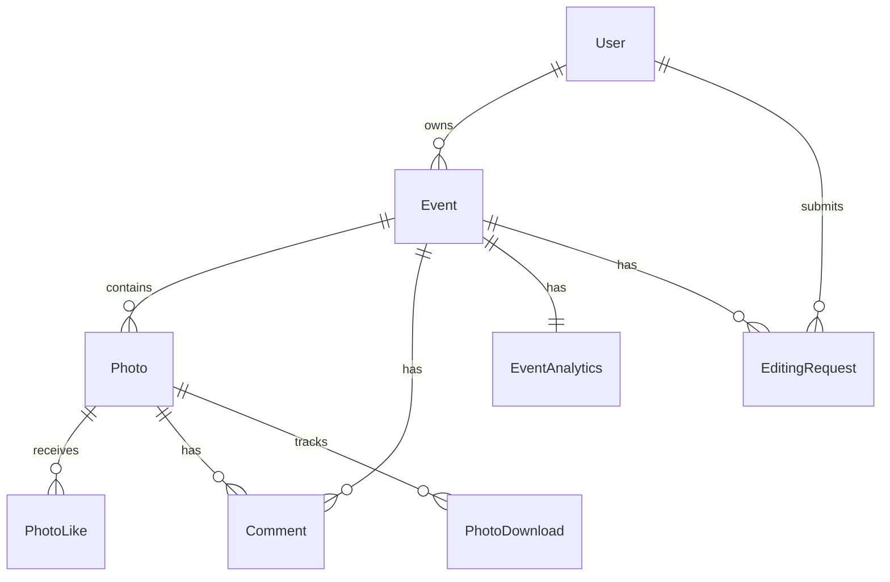

# Hafiportrait Architecture Documentation

**Last Updated:** December 2024  
**Version:** 1.0

---

## Overview

Dokumentasi arsitektur lengkap untuk Hafiportrait Photography Platform - platform galeri foto pernikahan mobile-first dengan fokus pada instant access, efficient workflow, dan scalable infrastructure.

---

## Quick Links

### Core Architecture
- [Main Architecture Document](../architecture.md) - Overview dan high-level architecture
- [Tech Stack](./tech-stack.md) - Technology decisions dan rationale
- [Database Schema](./database.md) - Data models dan Prisma schema
- [API Specification](./api-specification.md) - RESTful API endpoints

### Implementation Guides
- [Frontend Architecture](./frontend.md) - React + Vite frontend structure
- [Authentication & Security](./auth-security.md) - Auth flows dan security practices
- [Deployment Guide](./deployment.md) - Infrastructure dan CI/CD
- [Testing Strategy](./testing.md) - Unit, integration, dan E2E tests

### Standards & Operations
- [Coding Standards](./coding-standards.md) - Code conventions dan best practices

---

## Architecture Decisions

### Platform Choice
**Selected:** DigitalOcean VM + Managed Services  
**Why:** Cost-effective, full control, predictable costs untuk photography business

### Tech Stack Summary
- **Frontend:** React 18 + TypeScript + Vite + Tailwind CSS
- **Backend:** Node.js + Express + TypeScript
- **Database:** PostgreSQL 15 + Prisma ORM
- **Cache:** Redis 7
- **Storage:** Cloudflare R2 (zero egress fees) + CDN
- **Queue:** BullMQ with Redis
- **Deployment:** Docker + GitHub Actions

### Key Architectural Patterns
1. **Monorepo** with npm/pnpm workspaces
2. **RESTful API** architecture
3. **Layered backend** (Routes → Controllers → Services → Repositories)
4. **Component-based frontend** with React
5. **Queue-based background processing** for photos dan notifications
6. **Object storage + CDN** untuk photo delivery

---

## System Architecture Diagram

```
┌─────────────────────────────────────────────────────────────┐
│                        Users                                 │
│  Guest/Tamu    Client/Mempelai    Admin/Photographer        │
└────────────────────┬────────────────────────────────────────┘
                     │
                     ▼
┌─────────────────────────────────────────────────────────────┐
│              Cloudflare CDN & Edge                           │
│    DNS │ SSL │ DDoS Protection │ Static Assets │ Photos      │
└────────────────────┬────────────────────────────────────────┘
                     │
                     ▼
┌─────────────────────────────────────────────────────────────┐
│              Application Layer (Docker)                      │
│  ┌──────────────────┐        ┌──────────────────┐          │
│  │  React Frontend  │        │   Express API    │          │
│  │   (Vite Build)   │◄──────►│  (Node.js + TS)  │          │
│  └──────────────────┘        └──────────┬───────┘          │
│                                          │                   │
│                              ┌───────────▼────────────┐     │
│                              │  Background Worker     │     │
│                              │  (BullMQ + Sharp)      │     │
│                              └────────────────────────┘     │
└─────────────────────────────────────────────────────────────┘
                     │
        ┌────────────┼────────────┐
        ▼            ▼            ▼
┌──────────┐  ┌──────────┐  ┌──────────┐
│PostgreSQL│  │  Redis   │  │R2 Storage│
│ Database │  │  Cache   │  │  Photos  │
└──────────┘  └──────────┘  └──────────┘
```

---

## Project Structure

```
hafiportrait/
├── apps/
│   ├── web/                    # Frontend React + Vite
│   │   ├── src/
│   │   │   ├── components/    # UI components
│   │   │   ├── features/      # Feature modules
│   │   │   ├── pages/         # Page components
│   │   │   ├── hooks/         # Custom hooks
│   │   │   ├── services/      # API services
│   │   │   ├── stores/        # Zustand stores
│   │   │   └── utils/         # Utilities
│   │   └── vite.config.ts
│   │
│   ├── api/                    # Backend Express API
│   │   ├── src/
│   │   │   ├── routes/        # API routes
│   │   │   ├── controllers/   # Request handlers
│   │   │   ├── services/      # Business logic
│   │   │   ├── repositories/  # Data access
│   │   │   ├── middleware/    # Express middleware
│   │   │   └── utils/         # Utilities
│   │   └── tsconfig.json
│   │
│   └── worker/                 # Background job worker
│       └── src/
│           ├── jobs/          # Job processors
│           └── index.ts
│
├── packages/
│   ├── shared/                 # Shared TypeScript types
│   │   └── src/
│   │       └── types/
│   │
│   ├── database/               # Prisma database package
│   │   ├── prisma/
│   │   │   ├── schema.prisma
│   │   │   ├── migrations/
│   │   │   └── seed.ts
│   │   └── src/
│   │
│   └── ui/                     # Shared UI components (optional)
│
├── docs/                       # Documentation
│   ├── architecture.md         # Main architecture doc
│   ├── prd.md                  # Product requirements
│   └── architecture/           # Detailed architecture docs
│
├── scripts/                    # Build & deployment scripts
├── docker/                     # Docker configurations
├── .github/                    # GitHub Actions workflows
├── docker-compose.yml
├── package.json                # Root package.json with workspaces
└── pnpm-workspace.yaml
```

---

## Data Model Overview

### Core Entities



**Key Models:**
1. **User** - Admin/Photographer dan Client/Mempelai
2. **Event** - Wedding event dengan photos dan settings
3. **Photo** - Photo metadata (actual files di R2 storage)
4. **PhotoLike** - Guest likes (tanpa registration)
5. **Comment** - Comments/ucapan dari guests
6. **EditingRequest** - Client editing requests
7. **GuestSession** - Anonymous guest sessions
8. **EventAnalytics** - Aggregated analytics

---

## API Overview

### Base URL
- Development: `http://localhost:3000/api/v1`
- Production: `https://api.hafiportrait.com/v1`

### Authentication
- **Admin/Client:** JWT Bearer token
- **Guest:** Session cookie

### Key Endpoints

**Public (Guest Access):**
- `GET /events/:slug/public` - Event info
- `POST /events/:slug/verify-access` - Verify access code
- `GET /events/:slug/photos` - Get photos
- `POST /photos/:id/like` - Like photo
- `POST /photos/:id/comments` - Post comment

**Admin:**
- `POST /admin/events` - Create event
- `POST /admin/events/:id/photos` - Upload photos
- `GET /admin/analytics` - View analytics
- `PUT /admin/comments/:id/approve` - Moderate comments

**Client:**
- `POST /client/events/:id/download-batch` - Batch download
- `POST /client/editing-requests` - Request editing

---

## Security Highlights

### Multi-Layer Security
1. **Authentication:** JWT tokens untuk admin/client, session cookies untuk guests
2. **Authorization:** Role-based access control (RBAC)
3. **Input Validation:** Zod schema validation untuk all inputs
4. **XSS Prevention:** Input sanitization, CSP headers
5. **SQL Injection Prevention:** Prisma parameterized queries
6. **Rate Limiting:** Per-endpoint rate limits
7. **HTTPS Only:** Force HTTPS in production
8. **Secure File Access:** Signed URLs dengan expiry

### Data Protection
- **At Rest:** Sensitive data encryption
- **In Transit:** HTTPS/TLS untuk all connections
- **Passwords:** bcrypt hashing dengan salt
- **Sessions:** httpOnly, secure, sameSite cookies

---

## Performance Targets

### Frontend
- Lighthouse Performance Score: >90 (mobile), >95 (desktop)
- First Contentful Paint: <1.5s
- Largest Contentful Paint: <2.5s
- Time to Interactive: <3s

### Backend
- API Response Time: <500ms (p95)
- Database Query Time: <100ms (p95)
- Photo Upload Processing: <5s for batch
- Photo Download URL Generation: <200ms

### Infrastructure
- Uptime: 99.9%
- CDN Cache Hit Rate: >90%
- Database Connection Pool: 2-10 connections

---

## Deployment Strategy

### Environments

| Environment | Purpose | Infrastructure |
|-------------|---------|----------------|
| Development | Local development | Docker Compose |
| Staging | Pre-production testing | Single VM |
| Production | Live environment | HA setup (optional) |

### CI/CD Pipeline
1. **Test:** Run unit, integration tests
2. **Build:** Build Docker images
3. **Push:** Push to container registry
4. **Deploy:** SSH to server, pull images, restart containers
5. **Verify:** Health checks

### Rollback Strategy
- Keep previous Docker image
- Database backups before migrations
- Quick rollback via Docker tag

---

## Cost Estimate (MVP)

| Service | Monthly Cost |
|---------|--------------|
| DigitalOcean Droplet (4GB) | $24 |
| Managed PostgreSQL | $15 |
| Managed Redis | $15 |
| Cloudflare R2 Storage | $5-20 |
| Cloudflare CDN | Free |
| Domain & SSL | ~$1 |
| Backups | $5 |
| **Total** | **~$65-80/month** |

**Scalability Path:**
- Phase 1 (MVP): $65-80/month - Supports 10-20 events
- Phase 2 (Growth): $150-200/month - Supports 50+ events dengan HA
- Phase 3 (Scale): $300-500/month - Supports 100+ events dengan optimization

---

## Development Workflow

### Initial Setup

```bash
# Clone repository
git clone https://github.com/yourusername/hafiportrait.git
cd hafiportrait

# Install dependencies
pnpm install

# Start infrastructure
docker-compose up -d

# Run migrations
pnpm --filter @hafiportrait/database migrate

# Seed database
pnpm --filter @hafiportrait/database seed

# Start development servers
pnpm dev
```

### Development Commands

```bash
# Run all tests
pnpm test

# Run specific package
pnpm --filter @hafiportrait/web dev
pnpm --filter @hafiportrait/api dev

# Build for production
pnpm build

# Run linter
pnpm lint

# Format code
pnpm format

# Database operations
pnpm db:migrate       # Run migrations
pnpm db:seed          # Seed database
pnpm db:studio        # Open Prisma Studio
pnpm db:reset         # Reset database
```

---

## Key Design Decisions

### 1. Why Monorepo?
- **Type Sharing:** Frontend dan backend share TypeScript types
- **Atomic Changes:** Single PR dapat update frontend + backend + types
- **Simplified Dependencies:** Centralized dependency management
- **Developer Experience:** Single repo clone, single install

### 2. Why Not Next.js?
- **Simplicity:** Vite + React lebih simple untuk SPA
- **Flexibility:** Lebih flexible untuk customization
- **Mobile Migration:** Easier path ke React Native jika needed
- **Performance:** Vite HMR lebih fast

### 3. Why Cloudflare R2?
- **Cost:** Zero egress fees (huge saving untuk photo platform)
- **S3 Compatible:** Easy migration jika needed
- **CDN Integration:** Built-in Cloudflare CDN
- **Reliability:** Enterprise-grade infrastructure

### 4. Why PostgreSQL over MongoDB?
- **Relational Data:** Data heavily relational (events → photos → comments)
- **ACID Transactions:** Important untuk data consistency
- **Mature Ecosystem:** Better tooling dan ORMs
- **JSONB Support:** Flexibility ketika needed

### 5. Why BullMQ?
- **Reliability:** Redis-backed dengan persistence
- **Features:** Retries, scheduling, priorities, rate limiting
- **Monitoring:** Built-in UI untuk job monitoring
- **Performance:** Fast processing dengan concurrency control

---

## Future Enhancements

### Phase 2 (Post-MVP)
- [ ] Mobile app (React Native)
- [ ] Video support
- [ ] Live upload during event
- [ ] AI-powered photo selection
- [ ] Advanced analytics

### Phase 3 (Scale)
- [ ] Multi-photographer support
- [ ] White-label solution
- [ ] Advanced editing workflows
- [ ] Integration dengan payment gateway
- [ ] Automated photo backup ke client's cloud

---

## Getting Help

### Documentation
- [Main Architecture](../architecture.md)
- [Tech Stack Details](./tech-stack.md)
- [API Specification](./api-specification.md)
- [Coding Standards](./coding-standards.md)

### Support
- GitHub Issues untuk bugs dan feature requests
- Documentation updates via PRs
- Team discussions untuk architectural decisions

---

## Changelog

| Date | Version | Changes |
|------|---------|---------|
| Dec 2024 | 1.0 | Initial architecture documentation |

---

**Last Updated:** December 2024  
**Maintained By:** Hafiportrait Architecture Team
