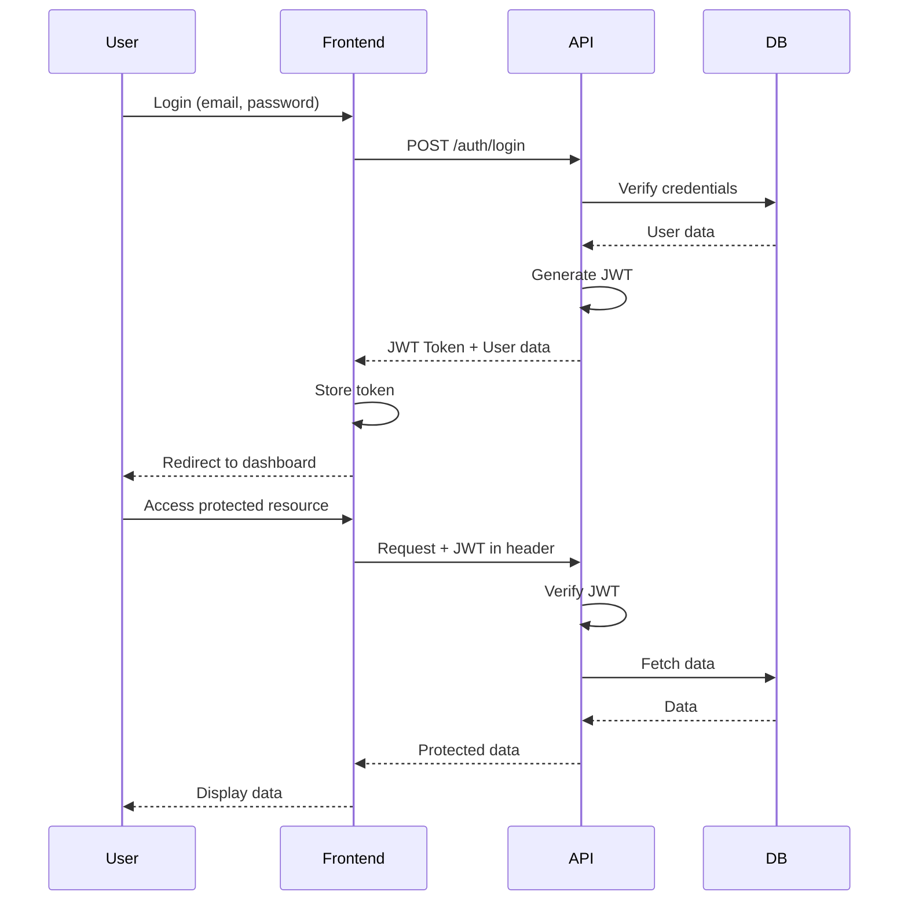

# Authentication & Security - Hafiportrait Photography Platform

**Last Updated:** December 2024

---

## Overview

Security architecture untuk Hafiportrait mencakup authentication, authorization, data protection, dan security best practices untuk melindungi data fotografer, klien, dan tamu.

---

## Authentication Architecture

### User Types & Authentication Methods

| User Type | Authentication Method | Storage | Expiry |
|-----------|----------------------|---------|--------|
| Admin/Photographer | JWT Token | httpOnly Cookie + localStorage | 7 days |
| Client/Mempelai | JWT Token | httpOnly Cookie + localStorage | 7 days |
| Guest/Tamu | Session Cookie | httpOnly Cookie | Session (browser close) |

### JWT Authentication Flow



### JWT Token Structure

```typescript
// Token Payload
interface JWTPayload {
  userId: string;
  email: string;
  role: 'ADMIN' | 'CLIENT';
  iat: number;  // Issued at
  exp: number;  // Expiry (7 days)
}

// Generate token
import jwt from 'jsonwebtoken';

const generateToken = (user: User): string => {
  return jwt.sign(
    {
      userId: user.id,
      email: user.email,
      role: user.role,
    },
    process.env.JWT_SECRET!,
    { expiresIn: '7d' }
  );
};

// Verify token
const verifyToken = (token: string): JWTPayload => {
  return jwt.verify(token, process.env.JWT_SECRET!) as JWTPayload;
};
```

### Guest Session Management

```typescript
// Guest sessions for non-authenticated access
interface GuestSession {
  sessionId: string;
  eventSlug: string;
  accessCode: string;
  ipAddress: string;
  userAgent: string;
  createdAt: Date;
  expiresAt: Date;
}

// Create guest session after access code verification
const createGuestSession = async (
  eventSlug: string,
  accessCode: string,
  req: Request
): Promise<GuestSession> => {
  const sessionId = uuidv4();
  
  // Store in Redis for fast access
  await redis.setex(
    `guest_session:${sessionId}`,
    86400, // 24 hours
    JSON.stringify({
      eventSlug,
      accessCode,
      ipAddress: req.ip,
      userAgent: req.headers['user-agent'],
    })
  );
  
  // Track in database for analytics
  await prisma.guestSession.create({
    data: {
      sessionId,
      eventId: event.id,
      ipAddress: req.ip,
      userAgent: req.headers['user-agent'],
    },
  });
  
  return sessionId;
};
```

---

## Authorization

### Role-Based Access Control (RBAC)

```typescript
enum UserRole {
  ADMIN = 'ADMIN',
  CLIENT = 'CLIENT',
}

// Permission matrix
const permissions = {
  ADMIN: [
    'events:create',
    'events:read',
    'events:update',
    'events:delete',
    'photos:upload',
    'photos:delete',
    'comments:moderate',
    'analytics:view',
    'portfolio:manage',
  ],
  CLIENT: [
    'events:read_own',
    'photos:download_batch',
    'editing_requests:create',
    'editing_requests:read_own',
  ],
};

// Middleware
const requireRole = (allowedRoles: UserRole[]) => {
  return (req: Request, res: Response, next: NextFunction) => {
    const user = req.user;
    
    if (!user) {
      return res.status(401).json({ error: 'Unauthorized' });
    }
    
    if (!allowedRoles.includes(user.role)) {
      return res.status(403).json({ error: 'Forbidden' });
    }
    
    next();
  };
};

// Usage
router.post('/admin/events', 
  authenticate,
  requireRole([UserRole.ADMIN]),
  createEventHandler
);
```

### Resource-Level Authorization

```typescript
// Check if client owns the event
const canAccessEvent = async (
  userId: string,
  eventId: string
): Promise<boolean> => {
  const event = await prisma.event.findUnique({
    where: { id: eventId },
    select: { clientId: true },
  });
  
  return event?.clientId === userId;
};

// Middleware
const requireEventOwnership = async (
  req: Request,
  res: Response,
  next: NextFunction
) => {
  const { eventId } = req.params;
  const userId = req.user!.id;
  
  if (!(await canAccessEvent(userId, eventId))) {
    return res.status(403).json({ error: 'Forbidden' });
  }
  
  next();
};
```

---

## Security Best Practices

### Password Security

```typescript
import bcrypt from 'bcrypt';

// Hash password (on registration/password change)
const hashPassword = async (password: string): Promise<string> => {
  const saltRounds = 10;
  return bcrypt.hash(password, saltRounds);
};

// Verify password (on login)
const verifyPassword = async (
  password: string,
  hash: string
): Promise<boolean> => {
  return bcrypt.compare(password, hash);
};

// Password policy
const passwordPolicy = {
  minLength: 8,
  requireUppercase: true,
  requireLowercase: true,
  requireNumbers: true,
  requireSpecialChars: false,
};

const validatePassword = (password: string): boolean => {
  if (password.length < passwordPolicy.minLength) return false;
  if (passwordPolicy.requireUppercase && !/[A-Z]/.test(password)) return false;
  if (passwordPolicy.requireLowercase && !/[a-z]/.test(password)) return false;
  if (passwordPolicy.requireNumbers && !/[0-9]/.test(password)) return false;
  return true;
};
```

### Input Validation & Sanitization

```typescript
import { z } from 'zod';

// Schema validation
const createEventSchema = z.object({
  slug: z.string()
    .min(3)
    .max(50)
    .regex(/^[a-z0-9-]+$/, 'Only lowercase letters, numbers, and hyphens'),
  title: z.string().min(5).max(200),
  eventDate: z.string().datetime(),
  description: z.string().max(5000).optional(),
  location: z.string().max(500).optional(),
});

// Validation middleware
const validateBody = (schema: z.ZodSchema) => {
  return (req: Request, res: Response, next: NextFunction) => {
    try {
      req.body = schema.parse(req.body);
      next();
    } catch (error) {
      if (error instanceof z.ZodError) {
        return res.status(400).json({
          error: 'Validation failed',
          details: error.errors,
        });
      }
      next(error);
    }
  };
};

// Usage
router.post('/admin/events',
  authenticate,
  requireRole([UserRole.ADMIN]),
  validateBody(createEventSchema),
  createEventHandler
);
```

### XSS Prevention

```typescript
import sanitizeHtml from 'sanitize-html';

// Sanitize user input (comments, descriptions)
const sanitizeUserInput = (input: string): string => {
  return sanitizeHtml(input, {
    allowedTags: [], // No HTML tags allowed
    allowedAttributes: {},
  });
};

// For rich text (if needed in future)
const sanitizeRichText = (input: string): string => {
  return sanitizeHtml(input, {
    allowedTags: ['b', 'i', 'em', 'strong', 'p', 'br'],
    allowedAttributes: {},
  });
};
```

### SQL Injection Prevention

```typescript
// Prisma prevents SQL injection by default with parameterized queries
// NEVER use raw SQL without parameterization

// Good (Prisma ORM)
const user = await prisma.user.findUnique({
  where: { email: userEmail }, // Automatically parameterized
});

// If raw SQL is absolutely necessary, use parameterized queries
const result = await prisma.$queryRaw`
  SELECT * FROM users WHERE email = ${userEmail}
`;
```

### CSRF Protection

```typescript
import csrf from 'csurf';

// CSRF middleware
const csrfProtection = csrf({
  cookie: {
    httpOnly: true,
    secure: process.env.NODE_ENV === 'production',
    sameSite: 'strict',
  },
});

// Apply to state-changing routes
router.post('/admin/events',
  csrfProtection,
  authenticate,
  createEventHandler
);

// Frontend: Include CSRF token in forms
<input type="hidden" name="_csrf" value={csrfToken} />
```

### Rate Limiting

```typescript
import rateLimit from 'express-rate-limit';

// Global rate limiter
const globalLimiter = rateLimit({
  windowMs: 15 * 60 * 1000, // 15 minutes
  max: 1000, // 1000 requests per window
  message: 'Too many requests, please try again later',
});

// Login rate limiter (stricter)
const loginLimiter = rateLimit({
  windowMs: 15 * 60 * 1000,
  max: 5, // 5 login attempts per 15 minutes
  skipSuccessfulRequests: true,
});

// Upload rate limiter
const uploadLimiter = rateLimit({
  windowMs: 60 * 60 * 1000, // 1 hour
  max: 50, // 50 uploads per hour
});

// Apply
app.use('/api', globalLimiter);
app.use('/api/auth/login', loginLimiter);
app.use('/api/admin/events/:id/photos', uploadLimiter);
```

---

## Data Protection

### Encryption at Rest

```typescript
// Sensitive data encryption
import crypto from 'crypto';

const algorithm = 'aes-256-gcm';
const secretKey = process.env.ENCRYPTION_KEY!;

const encrypt = (text: string): { encrypted: string; iv: string; tag: string } => {
  const iv = crypto.randomBytes(16);
  const cipher = crypto.createCipheriv(algorithm, Buffer.from(secretKey, 'hex'), iv);
  
  let encrypted = cipher.update(text, 'utf8', 'hex');
  encrypted += cipher.final('hex');
  
  const tag = cipher.getAuthTag();
  
  return {
    encrypted,
    iv: iv.toString('hex'),
    tag: tag.toString('hex'),
  };
};

const decrypt = (encrypted: string, iv: string, tag: string): string => {
  const decipher = crypto.createDecipheriv(
    algorithm,
    Buffer.from(secretKey, 'hex'),
    Buffer.from(iv, 'hex')
  );
  
  decipher.setAuthTag(Buffer.from(tag, 'hex'));
  
  let decrypted = decipher.update(encrypted, 'hex', 'utf8');
  decrypted += decipher.final('utf8');
  
  return decrypted;
};
```

### Encryption in Transit (HTTPS)

```typescript
// Force HTTPS in production
const requireHTTPS = (req: Request, res: Response, next: NextFunction) => {
  if (process.env.NODE_ENV === 'production' && !req.secure) {
    return res.redirect('https://' + req.headers.host + req.url);
  }
  next();
};

app.use(requireHTTPS);

// Security headers
import helmet from 'helmet';

app.use(helmet({
  contentSecurityPolicy: {
    directives: {
      defaultSrc: ["'self'"],
      styleSrc: ["'self'", "'unsafe-inline'"],
      scriptSrc: ["'self'"],
      imgSrc: ["'self'", 'https://cdn.hafiportrait.com', 'data:'],
      connectSrc: ["'self'", 'https://api.hafiportrait.com'],
    },
  },
  hsts: {
    maxAge: 31536000,
    includeSubDomains: true,
    preload: true,
  },
}));
```

### Secure File Storage

```typescript
// Generate secure, unpredictable file keys
const generateStorageKey = (
  eventId: string,
  filename: string
): string => {
  const randomId = crypto.randomBytes(16).toString('hex');
  const sanitizedFilename = filename.replace(/[^a-zA-Z0-9.-]/g, '_');
  return `events/${eventId}/photos/${randomId}_${sanitizedFilename}`;
};

// Signed URLs for temporary access
import { S3Client, GetObjectCommand } from '@aws-sdk/client-s3';
import { getSignedUrl } from '@aws-sdk/s3-request-presigner';

const generateSignedDownloadUrl = async (
  storageKey: string,
  expiresIn: number = 300 // 5 minutes
): Promise<string> => {
  const command = new GetObjectCommand({
    Bucket: process.env.S3_BUCKET,
    Key: storageKey,
  });
  
  return getSignedUrl(s3Client, command, { expiresIn });
};
```

---

## Session Management

### Session Security

```typescript
import session from 'express-session';
import RedisStore from 'connect-redis';

const sessionConfig = {
  store: new RedisStore({ client: redisClient }),
  secret: process.env.SESSION_SECRET!,
  resave: false,
  saveUninitialized: false,
  name: 'hafiportrait_session', // Don't use default name
  cookie: {
    httpOnly: true, // Prevent XSS
    secure: process.env.NODE_ENV === 'production', // HTTPS only in production
    sameSite: 'strict' as const, // CSRF protection
    maxAge: 24 * 60 * 60 * 1000, // 24 hours
  },
};

app.use(session(sessionConfig));
```

### Session Cleanup

```typescript
// Clean up expired sessions (cron job)
const cleanupExpiredSessions = async () => {
  // Redis sessions expire automatically
  
  // Clean database guest sessions
  await prisma.guestSession.deleteMany({
    where: {
      lastSeenAt: {
        lt: new Date(Date.now() - 24 * 60 * 60 * 1000),
      },
    },
  });
};

// Run daily
cron.schedule('0 0 * * *', cleanupExpiredSessions);
```

---

## Security Monitoring

### Audit Logging

```typescript
interface AuditLog {
  userId?: string;
  action: string;
  resource: string;
  resourceId?: string;
  ipAddress: string;
  userAgent: string;
  status: 'success' | 'failure';
  timestamp: Date;
  metadata?: Record<string, any>;
}

const logAuditEvent = async (log: AuditLog) => {
  await prisma.auditLog.create({ data: log });
  
  // Also log to external service (e.g., CloudWatch, Sentry)
  logger.info('Audit event', log);
};

// Middleware
const auditMiddleware = (action: string, resource: string) => {
  return async (req: Request, res: Response, next: NextFunction) => {
    const originalSend = res.send;
    
    res.send = function (data) {
      logAuditEvent({
        userId: req.user?.id,
        action,
        resource,
        resourceId: req.params.id,
        ipAddress: req.ip,
        userAgent: req.headers['user-agent'] || '',
        status: res.statusCode < 400 ? 'success' : 'failure',
        timestamp: new Date(),
      });
      
      return originalSend.call(this, data);
    };
    
    next();
  };
};
```

### Suspicious Activity Detection

```typescript
// Track failed login attempts
const trackFailedLogin = async (email: string, ip: string) => {
  const key = `failed_login:${email}:${ip}`;
  const count = await redis.incr(key);
  await redis.expire(key, 3600); // 1 hour
  
  if (count >= 5) {
    // Alert admin
    await sendSecurityAlert({
      type: 'MULTIPLE_FAILED_LOGINS',
      email,
      ip,
      count,
    });
    
    // Temporarily block IP
    await redis.setex(`blocked_ip:${ip}`, 3600, '1');
  }
};

// Check if IP is blocked
const isIpBlocked = async (ip: string): Promise<boolean> => {
  const blocked = await redis.get(`blocked_ip:${ip}`);
  return blocked === '1';
};
```

---

## Compliance & Privacy

### GDPR Compliance

```typescript
// User data export
const exportUserData = async (userId: string) => {
  const user = await prisma.user.findUnique({
    where: { id: userId },
    include: {
      clientEvents: true,
      editingRequests: true,
    },
  });
  
  return {
    personalData: {
      email: user.email,
      fullName: user.fullName,
      phone: user.phone,
    },
    events: user.clientEvents,
    editingRequests: user.editingRequests,
  };
};

// User data deletion
const deleteUserData = async (userId: string) => {
  // Anonymize instead of hard delete to preserve analytics
  await prisma.user.update({
    where: { id: userId },
    data: {
      email: `deleted_${userId}@deleted.com`,
      fullName: 'Deleted User',
      phone: null,
      isActive: false,
    },
  });
};
```

### Privacy Policy & Consent

- Display privacy policy on registration
- Cookie consent for guest sessions
- Data retention policy: Events expire based on storage duration
- Right to be forgotten: User can request data deletion

---

**Next:** [Storage & CDN Architecture](./storage-cdn.md)
