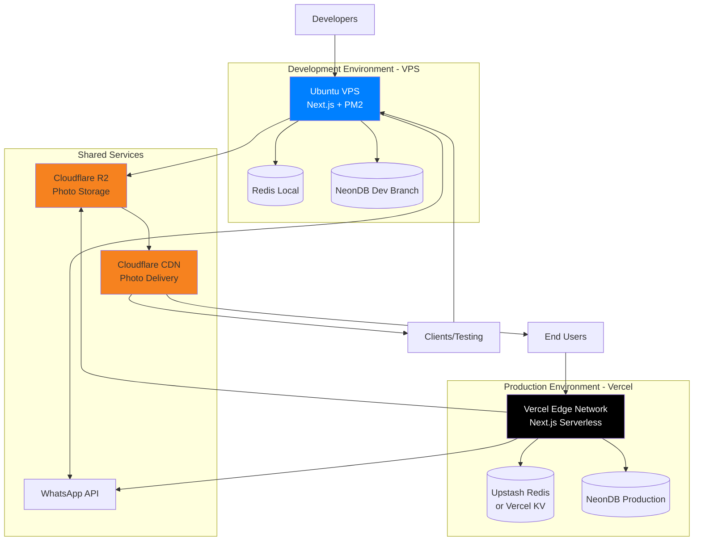

# Deployment Architecture - Hafiportrait Photography Platform

**Last Updated:** December 2024  
**Version:** 2.0 - Vercel + VPS Development

---

## Overview

Deployment architecture untuk Hafiportrait dirancang dengan **dual-environment strategy**: VPS untuk development/staging dengan public access, dan Vercel untuk production deployment yang optimal untuk Next.js.

---

## Infrastructure Overview



---

## Development Environment (VPS)

### Purpose
- **Development testing** dengan public URL
- **Client demos** dan stakeholder previews
- **Mobile device testing** (QR codes, real devices)
- **WhatsApp webhook testing** (requires public URL)
- **Integration testing** dengan external services

### Infrastructure

**VPS Specifications:**
- **Provider:** DigitalOcean, Hetzner, atau Vultr
- **CPU:** 2 vCPU
- **RAM:** 4GB
- **Storage:** 80GB SSD
- **OS:** Ubuntu 22.04 LTS
- **Cost:** ~$24-36/month

**Software Stack:**
- Next.js 15 (production build)
- PM2 (process manager)
- Nginx (reverse proxy)
- Redis (local instance)
- Node.js 20 LTS
- Let's Encrypt SSL

**Database:**
- NeonDB development branch
- Separate dari production
- Connection pooling enabled

### VPS Setup

```bash
# 1. Initial server setup
apt update && apt upgrade -y

# 2. Install Node.js 20
curl -fsSL https://deb.nodesource.com/setup_20.x | sudo -E bash -
apt-get install -y nodejs

# 3. Install pnpm
npm install -g pnpm

# 4. Install PM2
npm install -g pm2

# 5. Install Redis
apt-get install -y redis-server
systemctl enable redis-server
systemctl start redis-server

# 6. Install Nginx
apt-get install -y nginx

# 7. Clone repository
cd /home/hafiportrait
git clone https://github.com/hafiportrait/hafiportrait.git
cd hafiportrait

# 8. Install dependencies
pnpm install

# 9. Build application
pnpm build

# 10. Start with PM2
pm2 start npm --name "hafiportrait-dev" -- start
pm2 save
pm2 startup
```

### Nginx Configuration

```nginx
# /etc/nginx/sites-available/hafiportrait-dev
server {
    listen 443 ssl http2;
    server_name dev.hafiportrait.com;
    
    ssl_certificate /etc/letsencrypt/live/dev.hafiportrait.com/fullchain.pem;
    ssl_certificate_key /etc/letsencrypt/live/dev.hafiportrait.com/privkey.pem;
    
    location / {
        proxy_pass http://localhost:3000;
        proxy_http_version 1.1;
        proxy_set_header Upgrade $http_upgrade;
        proxy_set_header Connection 'upgrade';
        proxy_set_header Host $host;
        proxy_set_header X-Real-IP $remote_addr;
        proxy_set_header X-Forwarded-For $proxy_add_x_forwarded_for;
        proxy_set_header X-Forwarded-Proto $scheme;
        proxy_cache_bypass $http_upgrade;
    }
    
    # Socket.IO WebSocket support
    location /api/socket {
        proxy_pass http://localhost:3000;
        proxy_http_version 1.1;
        proxy_set_header Upgrade $http_upgrade;
        proxy_set_header Connection "upgrade";
        proxy_set_header Host $host;
        proxy_cache_bypass $http_upgrade;
        proxy_read_timeout 86400;
    }
    
    client_max_body_size 50M;
}
```

### Deployment Script

```bash
#!/bin/bash
# deploy-dev.sh

echo "🚀 Deploying to dev server..."

# Pull latest changes
git pull origin main || exit 1

# Install dependencies
pnpm install || exit 1

# Run migrations
pnpm prisma migrate deploy || exit 1

# Build application
pnpm build || exit 1

# Restart PM2
pm2 restart hafiportrait-dev || exit 1

echo "✅ Deployment complete!"
pm2 logs hafiportrait-dev --lines 20 --nostream
```

---

## Production Environment (Vercel)

### Purpose
- **Live production** deployment
- **Automatic scaling** based on traffic
- **Global CDN** untuk fast worldwide access
- **Zero-config** deployment
- **Preview deployments** untuk setiap PR

### Why Vercel?

**Advantages:**
- ✅ Built by Next.js creators (optimal compatibility)
- ✅ Zero-config deployment
- ✅ Automatic HTTPS dan custom domains
- ✅ Global edge network (20+ regions)
- ✅ Instant rollbacks
- ✅ Preview deployments per PR
- ✅ Built-in analytics dan monitoring
- ✅ Serverless functions auto-scaling
- ✅ Edge functions support
- ✅ Native Next.js optimizations

### Vercel Configuration

```json
// vercel.json
{
  "buildCommand": "pnpm build",
  "devCommand": "pnpm dev",
  "installCommand": "pnpm install",
  "framework": "nextjs",
  "regions": ["sin1", "hnd1"],
  "env": {
    "DATABASE_URL": "@database-url",
    "DIRECT_URL": "@direct-url",
    "NEXTAUTH_URL": "@nextauth-url",
    "NEXTAUTH_SECRET": "@nextauth-secret"
  },
  "build": {
    "env": {
      "NEXT_PUBLIC_API_URL": "https://hafiportrait.com/api",
      "NEXT_PUBLIC_CDN_URL": "https://photos.hafiportrait.com"
    }
  }
}
```

### Environment Variables (Vercel)

Configure di Vercel Dashboard atau via CLI:

```bash
# Production environment variables
vercel env add DATABASE_URL production
vercel env add DIRECT_URL production
vercel env add NEXTAUTH_URL production
vercel env add NEXTAUTH_SECRET production
vercel env add R2_ACCOUNT_ID production
vercel env add R2_ACCESS_KEY_ID production
vercel env add R2_SECRET_ACCESS_KEY production
vercel env add R2_BUCKET_NAME production
vercel env add REDIS_URL production
vercel env add WHATSAPP_API_KEY production
vercel env add SENTRY_DSN production
```

### Deployment Process

**Automatic Deployment:**
```bash
# Push to main branch
git push origin main

# Vercel automatically:
# 1. Detects changes
# 2. Builds application
# 3. Runs tests (if configured)
# 4. Deploys to production
# 5. Updates DNS
```

**Manual Deployment:**
```bash
# Install Vercel CLI
npm install -g vercel

# Login
vercel login

# Deploy to production
vercel --prod

# Check deployment status
vercel ls
```

**Preview Deployments:**
```bash
# Every PR automatically gets preview deployment
# URL: https://hafiportrait-git-branch-name.vercel.app

# Test preview deployment
# Merge PR when ready
# Automatic production deployment
```

---

## Database Strategy

### NeonDB Configuration

**Development Branch:**
- Branch name: `dev`
- Used by: VPS development server
- Connection string: `postgresql://...@ep-xxx-dev.neon.tech/...`

**Production Database:**
- Branch name: `main`
- Used by: Vercel production
- Connection string: `postgresql://...@ep-xxx.neon.tech/...`
- Automatic backups enabled
- Point-in-time recovery

### Connection Pooling

```typescript
// lib/prisma.ts
import { PrismaClient } from '@prisma/client';

// Use connection pooling for serverless
const prisma = new PrismaClient({
  datasources: {
    db: {
      url: process.env.DATABASE_URL,
    },
  },
  log: process.env.NODE_ENV === 'development' ? ['query'] : [],
});

export { prisma };
```

**NeonDB automatically handles:**
- ✅ Connection pooling (via PgBouncer)
- ✅ Auto-scaling based on load
- ✅ Connection reuse in serverless

---

## Redis Strategy

### Development (VPS)
- Local Redis instance on VPS
- Cost: Included in VPS
- Configuration: Standard Redis setup

### Production (Vercel)

**Option 1: Upstash Redis (Recommended)**
```bash
# Serverless Redis for Vercel
# Free tier: 10,000 commands/day

# Install
npm install @upstash/redis

# Usage
import { Redis } from '@upstash/redis';

const redis = new Redis({
  url: process.env.UPSTASH_REDIS_REST_URL,
  token: process.env.UPSTASH_REDIS_REST_TOKEN,
});
```

**Option 2: Vercel KV**
```bash
# Native Vercel key-value storage
# Built on Upstash

# Install
npm install @vercel/kv

# Usage
import { kv } from '@vercel/kv';

await kv.set('key', 'value');
const value = await kv.get('key');
```

**Cost:**
- Upstash Free: 10K commands/day
- Upstash Pro: From $10/month
- Vercel KV: Included in Pro plan

---

## Storage & CDN

### Cloudflare R2 Configuration

**Buckets:**
- `hafiportrait-photos-dev` - Development
- `hafiportrait-photos` - Production

**Configuration:**
```typescript
// lib/r2.ts
import { S3Client, PutObjectCommand } from '@aws-sdk/client-s3';

const r2Client = new S3Client({
  region: 'auto',
  endpoint: `https://${process.env.R2_ACCOUNT_ID}.r2.cloudflarestorage.com`,
  credentials: {
    accessKeyId: process.env.R2_ACCESS_KEY_ID!,
    secretAccessKey: process.env.R2_SECRET_ACCESS_KEY!,
  },
});

export async function uploadToR2(key: string, file: File) {
  const command = new PutObjectCommand({
    Bucket: process.env.R2_BUCKET_NAME,
    Key: key,
    Body: file,
    ContentType: file.type,
  });

  await r2Client.send(command);
  return `${process.env.R2_PUBLIC_URL}/${key}`;
}
```

### CDN Setup

**Cloudflare CDN:**
1. Create R2 bucket
2. Enable public access
3. Configure custom domain (photos.hafiportrait.com)
4. Automatic CDN via Cloudflare

**Benefits:**
- ✅ Zero egress fees
- ✅ Global edge caching
- ✅ Automatic image optimization (optional)
- ✅ DDoS protection

---

## CI/CD Pipeline

### GitHub Actions Workflow

```yaml
# .github/workflows/deploy.yml
name: Deploy to Production

on:
  push:
    branches: [main]
  pull_request:
    branches: [main]

jobs:
  test:
    runs-on: ubuntu-latest
    steps:
      - uses: actions/checkout@v3
      
      - name: Setup Node.js
        uses: actions/setup-node@v3
        with:
          node-version: '20'
      
      - name: Install pnpm
        uses: pnpm/action-setup@v2
        with:
          version: 8
      
      - name: Install dependencies
        run: pnpm install
      
      - name: Run linter
        run: pnpm lint
      
      - name: Run type check
        run: pnpm type-check
      
      - name: Run tests
        run: pnpm test
        env:
          DATABASE_URL: ${{ secrets.TEST_DATABASE_URL }}
  
  deploy-dev:
    needs: test
    if: github.ref == 'refs/heads/main'
    runs-on: ubuntu-latest
    steps:
      - name: Deploy to VPS Dev
        uses: appleboy/ssh-action@master
        with:
          host: ${{ secrets.VPS_HOST }}
          username: ${{ secrets.VPS_USER }}
          key: ${{ secrets.VPS_SSH_KEY }}
          script: |
            cd /home/hafiportrait/hafiportrait
            ./deploy-dev.sh
  
  deploy-production:
    needs: test
    if: github.ref == 'refs/heads/main'
    runs-on: ubuntu-latest
    steps:
      - uses: actions/checkout@v3
      
      - name: Deploy to Vercel
        uses: amondnet/vercel-action@v20
        with:
          vercel-token: ${{ secrets.VERCEL_TOKEN }}
          vercel-org-id: ${{ secrets.VERCEL_ORG_ID }}
          vercel-project-id: ${{ secrets.VERCEL_PROJECT_ID }}
          vercel-args: '--prod'
```

---

## Monitoring & Observability

### Vercel Analytics

Built-in monitoring:
- ✅ Web Vitals (LCP, FID, CLS)
- ✅ Server function metrics
- ✅ Edge function metrics
- ✅ Real user monitoring

### Sentry Integration

```typescript
// sentry.client.config.ts
import * as Sentry from '@sentry/nextjs';

Sentry.init({
  dsn: process.env.NEXT_PUBLIC_SENTRY_DSN,
  environment: process.env.NODE_ENV,
  tracesSampleRate: 1.0,
  replaysSessionSampleRate: 0.1,
  replaysOnErrorSampleRate: 1.0,
});
```

```typescript
// sentry.server.config.ts
import * as Sentry from '@sentry/nextjs';

Sentry.init({
  dsn: process.env.SENTRY_DSN,
  environment: process.env.NODE_ENV,
  tracesSampleRate: 1.0,
});
```

### Health Checks

```typescript
// app/api/health/route.ts
export async function GET() {
  const health = {
    status: 'healthy',
    timestamp: new Date().toISOString(),
    environment: process.env.NODE_ENV,
    checks: {
      database: await checkDatabase(),
      redis: await checkRedis(),
      storage: await checkStorage(),
    },
  };

  const status = health.checks.database === 'healthy' ? 200 : 503;
  return Response.json(health, { status });
}
```

---

## Cost Estimation

### Development Environment (VPS)

| Service | Cost/Month |
|---------|------------|
| VPS (2 vCPU, 4GB RAM) | $24-36 |
| NeonDB (Dev Branch) | Free |
| Redis (Local) | Included |
| Cloudflare R2 (Dev) | ~$5 |
| Domain + SSL | $1 |
| **Total** | **~$30-42** |

### Production Environment (Vercel)

| Service | Cost/Month |
|---------|------------|
| Vercel Pro | $20/user |
| NeonDB Production | $19-69 |
| Upstash Redis / Vercel KV | $0-10 |
| Cloudflare R2 | $15-50 |
| Cloudflare CDN | Free |
| Sentry | $0-26 |
| **Total (MVP)** | **~$54-175** |

**Total Combined (Dev + Prod):** ~$84-217/month

### Scaling Costs

**Small Business (10-30 events/month):**
- Vercel: $20/month
- NeonDB: $19/month
- Redis: Free tier
- R2 + CDN: $20/month
- **Total: ~$59/month**

**Growing Business (50-100 events/month):**
- Vercel: $20/month
- NeonDB: $69/month
- Redis: $10/month
- R2 + CDN: $50/month
- **Total: ~$149/month**

**Established Business (200+ events/month):**
- Vercel: $20-40/month
- NeonDB: $150/month
- Redis: $20/month
- R2 + CDN: $100/month
- **Total: ~$290-310/month**

---

## Backup & Disaster Recovery

### Database Backups

**NeonDB Automatic Backups:**
- Daily automatic backups
- 7-day retention (free tier)
- 30-day retention (paid tier)
- Point-in-time recovery

**Manual Backups:**
```bash
# Backup database
pg_dump "$DATABASE_URL" > backup_$(date +%Y%m%d).sql

# Upload to R2
aws s3 cp backup_20241215.sql \
  s3://hafiportrait-backups/ \
  --endpoint-url https://xxx.r2.cloudflarestorage.com
```

### Storage Backups

**Cloudflare R2:**
- Built-in redundancy (3 copies minimum)
- 99.999999999% durability
- Cross-region replication (optional)

### Recovery Procedures

**Database Recovery:**
1. Access NeonDB console
2. Select restore point
3. Create new branch or restore to main
4. Update connection strings
5. Redeploy application

**Application Rollback:**
```bash
# Vercel instant rollback
vercel rollback <deployment-url>

# Or via dashboard
# Deployments → Select previous → Promote to Production
```

---

## Security Considerations

### VPS Security

```bash
# Firewall configuration
ufw allow 22/tcp    # SSH
ufw allow 80/tcp    # HTTP
ufw allow 443/tcp   # HTTPS
ufw enable

# Fail2ban for SSH protection
apt-get install fail2ban
systemctl enable fail2ban
systemctl start fail2ban

# Regular updates
apt update && apt upgrade -y
```

### Vercel Security

**Built-in Protection:**
- ✅ DDoS protection
- ✅ Automatic HTTPS
- ✅ Environment variable encryption
- ✅ Preview deployment authentication
- ✅ Edge rate limiting

### Secrets Management

**Development (VPS):**
- Environment variables in `.env.development`
- File permissions: `chmod 600 .env.development`
- Never commit to Git

**Production (Vercel):**
- Encrypted environment variables
- Access via Vercel dashboard or CLI
- Automatic injection during build

---

## Domain Configuration

### DNS Setup

```
# DNS Records
Type: A
Name: @
Value: 76.76.21.21 (Vercel)

Type: CNAME
Name: www
Value: cname.vercel-dns.com

Type: A
Name: dev
Value: your-vps-ip

Type: CNAME
Name: photos
Value: your-r2-bucket.r2.dev
```

### SSL Certificates

**VPS (Let's Encrypt):**
```bash
certbot --nginx -d dev.hafiportrait.com
```

**Vercel (Automatic):**
- Automatic SSL for all domains
- Auto-renewal
- Support for wildcard certificates

---

## Performance Optimization

### Vercel Edge Functions

```typescript
// middleware.ts
import { NextResponse } from 'next/server';
import type { NextRequest } from 'next/server';

export function middleware(request: NextRequest) {
  // Run at edge for fastest response
  const response = NextResponse.next();
  
  // Add security headers
  response.headers.set('X-Frame-Options', 'DENY');
  response.headers.set('X-Content-Type-Options', 'nosniff');
  
  return response;
}

export const config = {
  matcher: '/:path*',
};
```

### CDN Caching

```typescript
// app/api/photos/[id]/route.ts
export async function GET(req: Request) {
  const photo = await getPhoto(id);
  
  return new Response(JSON.stringify(photo), {
    headers: {
      'Content-Type': 'application/json',
      'Cache-Control': 'public, s-maxage=3600, stale-while-revalidate=7200',
    },
  });
}
```

---

**Next:** [Testing Strategy](./testing.md)
