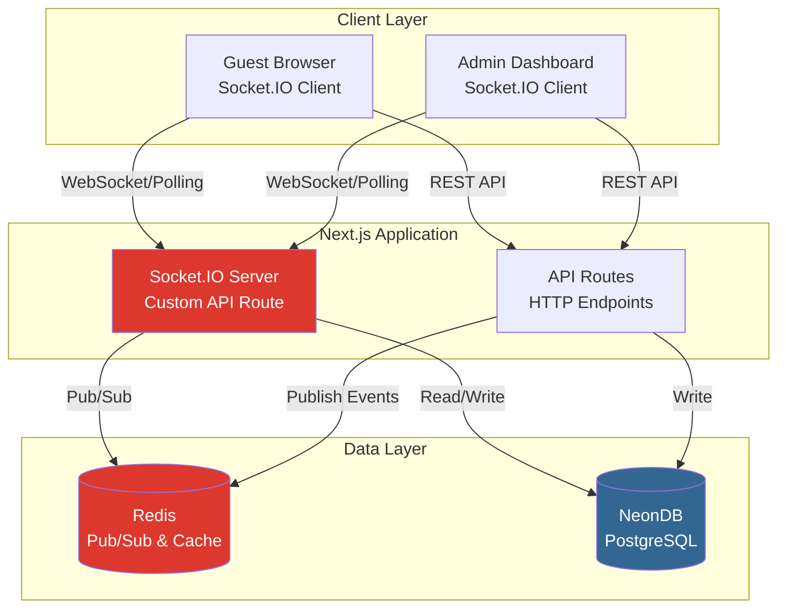

# Realtime Architecture - Hafiportrait Photography Platform

**Last Updated:** December 2024  
**Version:** 1.0

---

## Overview

Hafiportrait menggunakan **Socket.IO** untuk implementasi fitur realtime yang meningkatkan user engagement dan memberikan feedback instan kepada guests dan admin. Realtime features mencakup live comments, instant likes, dan real-time notifications.

---

## Architecture Overview



---

## Socket.IO Server Setup

### Next.js Custom Server (API Route)

Socket.IO berjalan sebagai custom API route di Next.js.

```typescript
// app/api/socket/route.ts
import { NextRequest } from 'next/server';
import { Server as SocketIOServer } from 'socket.io';
import { Server as HTTPServer } from 'http';

// Global socket instance (singleton)
let io: SocketIOServer | null = null;

export async function GET(req: NextRequest) {
  if (!io) {
    // Initialize Socket.IO server
    const httpServer = req.socket?.server as any;
    io = new SocketIOServer(httpServer, {
      path: '/api/socket',
      cors: {
        origin: process.env.SOCKET_IO_CORS_ORIGIN || 'http://localhost:3000',
        methods: ['GET', 'POST'],
        credentials: true,
      },
      transports: ['websocket', 'polling'],
    });

    // Setup event handlers
    setupSocketHandlers(io);
  }

  return new Response('Socket.IO server running', { status: 200 });
}

function setupSocketHandlers(io: SocketIOServer) {
  io.on('connection', (socket) => {
    console.log('Client connected:', socket.id);

    // Join event room
    socket.on('join:event', (eventSlug: string) => {
      socket.join(`event:${eventSlug}`);
      console.log(`Socket ${socket.id} joined event:${eventSlug}`);
    });

    // Leave event room
    socket.on('leave:event', (eventSlug: string) => {
      socket.leave(`event:${eventSlug}`);
      console.log(`Socket ${socket.id} left event:${eventSlug}`);
    });

    // Handle photo like
    socket.on('photo:like', async (data) => {
      const { photoId, eventSlug } = data;
      
      // Broadcast to all clients in event room
      io.to(`event:${eventSlug}`).emit('photo:liked', {
        photoId,
        timestamp: Date.now(),
      });
    });

    // Handle new comment
    socket.on('comment:new', async (data) => {
      const { photoId, eventSlug, comment } = data;
      
      // Broadcast to event room
      io.to(`event:${eventSlug}`).emit('comment:added', {
        photoId,
        comment,
        timestamp: Date.now(),
      });
      
      // Notify admins
      io.to('admin').emit('notification:new-comment', {
        photoId,
        eventSlug,
        comment,
      });
    });

    // Admin-specific room
    socket.on('join:admin', () => {
      socket.join('admin');
      console.log(`Admin joined: ${socket.id}`);
    });

    socket.on('disconnect', () => {
      console.log('Client disconnected:', socket.id);
    });
  });
}
```

### Alternative: Standalone Socket.IO Server

Untuk production dengan high traffic, gunakan standalone Socket.IO server:

```typescript
// server.ts (Custom server)
import { createServer } from 'http';
import { parse } from 'url';
import next from 'next';
import { Server as SocketIOServer } from 'socket.io';
import { setupSocketHandlers } from './lib/socket-server';

const dev = process.env.NODE_ENV !== 'production';
const app = next({ dev });
const handle = app.getRequestHandler();

app.prepare().then(() => {
  const server = createServer((req, res) => {
    const parsedUrl = parse(req.url!, true);
    handle(req, res, parsedUrl);
  });

  // Initialize Socket.IO
  const io = new SocketIOServer(server, {
    cors: {
      origin: process.env.SOCKET_IO_CORS_ORIGIN,
      methods: ['GET', 'POST'],
      credentials: true,
    },
  });

  setupSocketHandlers(io);

  const port = process.env.PORT || 3000;
  server.listen(port, () => {
    console.log(`> Ready on http://localhost:${port}`);
  });
});
```

---

## Client Integration

### Socket.IO Client Hook

```typescript
// hooks/useSocket.ts
import { useEffect, useState } from 'react';
import { io, Socket } from 'socket.io-client';

let socket: Socket | null = null;

export function useSocket() {
  const [isConnected, setIsConnected] = useState(false);

  useEffect(() => {
    // Initialize socket connection
    if (!socket) {
      socket = io(process.env.NEXT_PUBLIC_SOCKET_URL || '', {
        path: '/api/socket',
        transports: ['websocket', 'polling'],
        reconnection: true,
        reconnectionDelay: 1000,
        reconnectionAttempts: 5,
      });

      socket.on('connect', () => {
        console.log('Socket connected');
        setIsConnected(true);
      });

      socket.on('disconnect', () => {
        console.log('Socket disconnected');
        setIsConnected(false);
      });

      socket.on('connect_error', (error) => {
        console.error('Socket connection error:', error);
        setIsConnected(false);
      });
    }

    return () => {
      // Don't disconnect on unmount (keep connection alive)
      // socket?.disconnect();
    };
  }, []);

  return {
    socket,
    isConnected,
  };
}
```

### Realtime Features Hook

```typescript
// hooks/useRealtimeEvent.ts
import { useEffect, useCallback } from 'react';
import { useSocket } from './useSocket';
import { useQueryClient } from '@tanstack/react-query';

export function useRealtimeEvent(eventSlug: string) {
  const { socket, isConnected } = useSocket();
  const queryClient = useQueryClient();

  useEffect(() => {
    if (!socket || !isConnected) return;

    // Join event room
    socket.emit('join:event', eventSlug);

    // Listen for photo likes
    socket.on('photo:liked', (data) => {
      // Update photo cache
      queryClient.invalidateQueries(['photos', data.photoId]);
    });

    // Listen for new comments
    socket.on('comment:added', (data) => {
      // Update comments cache
      queryClient.invalidateQueries(['comments', data.photoId]);
    });

    return () => {
      // Leave event room on cleanup
      socket.emit('leave:event', eventSlug);
      socket.off('photo:liked');
      socket.off('comment:added');
    };
  }, [socket, isConnected, eventSlug, queryClient]);

  const emitLike = useCallback((photoId: string) => {
    if (!socket || !isConnected) return;
    socket.emit('photo:like', { photoId, eventSlug });
  }, [socket, isConnected, eventSlug]);

  const emitComment = useCallback((photoId: string, comment: any) => {
    if (!socket || !isConnected) return;
    socket.emit('comment:new', { photoId, eventSlug, comment });
  }, [socket, isConnected, eventSlug]);

  return {
    isConnected,
    emitLike,
    emitComment,
  };
}
```

---

## Realtime Features Implementation

### 1. Live Photo Likes

**Component Implementation:**

```typescript
// components/features/photos/PhotoLikeButton.tsx
'use client';

import { useState, useEffect } from 'react';
import { Heart } from 'lucide-react';
import { useRealtimeEvent } from '@/hooks/useRealtimeEvent';
import { useMutation } from '@tanstack/react-query';

interface PhotoLikeButtonProps {
  photoId: string;
  eventSlug: string;
  initialLikeCount: number;
  initialIsLiked: boolean;
}

export function PhotoLikeButton({
  photoId,
  eventSlug,
  initialLikeCount,
  initialIsLiked,
}: PhotoLikeButtonProps) {
  const [likeCount, setLikeCount] = useState(initialLikeCount);
  const [isLiked, setIsLiked] = useState(initialIsLiked);
  const { emitLike, isConnected } = useRealtimeEvent(eventSlug);

  const likeMutation = useMutation({
    mutationFn: async () => {
      const response = await fetch(`/api/photos/${photoId}/like`, {
        method: 'POST',
      });
      return response.json();
    },
    onMutate: () => {
      // Optimistic update
      setIsLiked(true);
      setLikeCount((prev) => prev + 1);
    },
    onSuccess: () => {
      // Emit realtime event
      emitLike(photoId);
    },
    onError: () => {
      // Rollback on error
      setIsLiked(false);
      setLikeCount((prev) => prev - 1);
    },
  });

  const handleLike = () => {
    if (isLiked) return;
    likeMutation.mutate();
  };

  return (
    <button
      onClick={handleLike}
      disabled={isLiked}
      className={`flex items-center gap-2 transition-colors ${
        isLiked ? 'text-red-500' : 'text-gray-600 hover:text-red-500'
      }`}
    >
      <Heart
        className={`w-6 h-6 ${isLiked ? 'fill-current' : ''}`}
      />
      <span className="text-sm font-medium">{likeCount}</span>
      {isConnected && (
        <span className="w-2 h-2 bg-green-500 rounded-full" title="Live" />
      )}
    </button>
  );
}
```

### 2. Live Comments

**Component Implementation:**

```typescript
// components/features/comments/LiveCommentList.tsx
'use client';

import { useState, useEffect } from 'react';
import { useSocket } from '@/hooks/useSocket';
import { useQuery } from '@tanstack/react-query';

interface LiveCommentListProps {
  photoId: string;
  eventSlug: string;
}

export function LiveCommentList({ photoId, eventSlug }: LiveCommentListProps) {
  const { socket, isConnected } = useSocket();
  const [localComments, setLocalComments] = useState<Comment[]>([]);

  // Fetch initial comments
  const { data: comments = [] } = useQuery({
    queryKey: ['comments', photoId],
    queryFn: () => fetch(`/api/photos/${photoId}/comments`).then(r => r.json()),
  });

  useEffect(() => {
    setLocalComments(comments);
  }, [comments]);

  useEffect(() => {
    if (!socket || !isConnected) return;

    // Join event room
    socket.emit('join:event', eventSlug);

    // Listen for new comments
    socket.on('comment:added', (data) => {
      if (data.photoId === photoId) {
        setLocalComments((prev) => [...prev, data.comment]);
      }
    });

    return () => {
      socket.off('comment:added');
    };
  }, [socket, isConnected, eventSlug, photoId]);

  return (
    <div className="space-y-4">
      {isConnected && (
        <div className="flex items-center gap-2 text-sm text-green-600">
          <span className="w-2 h-2 bg-green-500 rounded-full animate-pulse" />
          <span>Live updates aktif</span>
        </div>
      )}
      
      {localComments.map((comment) => (
        <div key={comment.id} className="bg-white p-4 rounded-lg shadow">
          <div className="flex items-start gap-3">
            <div className="flex-1">
              <p className="font-semibold text-gray-900">{comment.authorName}</p>
              <p className="text-gray-700 mt-1">{comment.content}</p>
              <p className="text-xs text-gray-500 mt-2">
                {new Date(comment.createdAt).toLocaleString('id-ID')}
              </p>
            </div>
          </div>
        </div>
      ))}
    </div>
  );
}
```

### 3. Admin Real-time Notifications

**Component Implementation:**

```typescript
// components/features/admin/RealtimeNotifications.tsx
'use client';

import { useState, useEffect } from 'react';
import { useSocket } from '@/hooks/useSocket';
import { Bell } from 'lucide-react';
import { toast } from 'sonner';

export function RealtimeNotifications() {
  const { socket, isConnected } = useSocket();
  const [notifications, setNotifications] = useState<any[]>([]);

  useEffect(() => {
    if (!socket || !isConnected) return;

    // Join admin room
    socket.emit('join:admin');

    // Listen for new comment notifications
    socket.on('notification:new-comment', (data) => {
      setNotifications((prev) => [data, ...prev]);
      
      // Show toast notification
      toast.info('Komentar baru!', {
        description: `Event: ${data.eventSlug}`,
        action: {
          label: 'Lihat',
          onClick: () => {
            window.location.href = `/admin/comments`;
          },
        },
      });
    });

    return () => {
      socket.off('notification:new-comment');
    };
  }, [socket, isConnected]);

  return (
    <div className="relative">
      <button className="relative p-2 rounded-lg hover:bg-gray-100">
        <Bell className="w-6 h-6 text-gray-700" />
        {notifications.length > 0 && (
          <span className="absolute top-0 right-0 w-4 h-4 bg-red-500 rounded-full text-xs text-white flex items-center justify-center">
            {notifications.length}
          </span>
        )}
      </button>
      {isConnected && (
        <span className="absolute bottom-0 right-0 w-2 h-2 bg-green-500 rounded-full" />
      )}
    </div>
  );
}
```

---

## Room Management

### Event-based Rooms

Setiap event memiliki room tersendiri untuk isolasi traffic:

```typescript
// Room naming convention
const eventRoom = `event:${eventSlug}`;

// Join room
socket.join(eventRoom);

// Broadcast to room
io.to(eventRoom).emit('photo:liked', data);

// Leave room
socket.leave(eventRoom);
```

### Admin Room

Admin memiliki dedicated room untuk notifications:

```typescript
// Admin room
const adminRoom = 'admin';

// Join admin room
socket.join(adminRoom);

// Send to all admins
io.to(adminRoom).emit('notification:new-comment', data);
```

---

## Event Types

### Client Events (Emit from Client)

| Event | Payload | Description |
|-------|---------|-------------|
| `join:event` | `{ eventSlug: string }` | Join event room |
| `leave:event` | `{ eventSlug: string }` | Leave event room |
| `photo:like` | `{ photoId: string, eventSlug: string }` | Like a photo |
| `comment:new` | `{ photoId: string, eventSlug: string, comment: object }` | Post new comment |
| `join:admin` | `{}` | Join admin room |

### Server Events (Emit from Server)

| Event | Payload | Description |
|-------|---------|-------------|
| `photo:liked` | `{ photoId: string, timestamp: number }` | Photo was liked |
| `comment:added` | `{ photoId: string, comment: object }` | New comment added |
| `notification:new-comment` | `{ photoId: string, eventSlug: string, comment: object }` | New comment (admin only) |
| `connect` | `{}` | Socket connected |
| `disconnect` | `{}` | Socket disconnected |

---

## Redis Pub/Sub Integration

Untuk horizontal scaling dengan multiple server instances:

```typescript
// lib/socket-redis.ts
import { Server as SocketIOServer } from 'socket.io';
import { createAdapter } from '@socket.io/redis-adapter';
import { createClient } from 'redis';

export function setupRedisAdapter(io: SocketIOServer) {
  const pubClient = createClient({ url: process.env.REDIS_URL });
  const subClient = pubClient.duplicate();

  Promise.all([pubClient.connect(), subClient.connect()]).then(() => {
    io.adapter(createAdapter(pubClient, subClient));
    console.log('Socket.IO Redis adapter configured');
  });
}
```

**Usage:**

```typescript
// app/api/socket/route.ts
import { setupRedisAdapter } from '@/lib/socket-redis';

function setupSocketHandlers(io: SocketIOServer) {
  // Setup Redis adapter for multi-server
  if (process.env.REDIS_URL) {
    setupRedisAdapter(io);
  }
  
  // ... rest of handlers
}
```

---

## Authentication & Security

### Socket.IO Middleware

```typescript
// lib/socket-auth.ts
import { Socket } from 'socket.io';
import { verify } from 'jsonwebtoken';

export function authMiddleware(socket: Socket, next: (err?: Error) => void) {
  const token = socket.handshake.auth.token;

  if (!token) {
    // Allow guest connections
    socket.data.role = 'GUEST';
    socket.data.sessionId = socket.handshake.auth.sessionId;
    return next();
  }

  try {
    const decoded = verify(token, process.env.NEXTAUTH_SECRET!);
    socket.data.user = decoded;
    socket.data.role = (decoded as any).role;
    next();
  } catch (error) {
    next(new Error('Authentication failed'));
  }
}

// Apply middleware
io.use(authMiddleware);
```

### Rate Limiting

```typescript
// lib/socket-rate-limit.ts
import { Socket } from 'socket.io';

const rateLimits = new Map<string, { count: number; resetAt: number }>();

export function rateLimitMiddleware(socket: Socket, next: (err?: Error) => void) {
  const identifier = socket.data.user?.id || socket.id;
  const now = Date.now();
  const limit = rateLimits.get(identifier);

  if (!limit || now > limit.resetAt) {
    rateLimits.set(identifier, {
      count: 1,
      resetAt: now + 60000, // 1 minute
    });
    return next();
  }

  if (limit.count >= 60) {
    return next(new Error('Rate limit exceeded'));
  }

  limit.count++;
  next();
}
```

---

## Performance Optimization

### Connection Pooling

```typescript
// Limit max connections per client
const io = new SocketIOServer(server, {
  maxHttpBufferSize: 1e6, // 1MB
  pingTimeout: 60000,
  pingInterval: 25000,
  connectTimeout: 45000,
});
```

### Message Compression

```typescript
// Enable per-message compression
const io = new SocketIOServer(server, {
  perMessageDeflate: {
    threshold: 1024, // Compress messages > 1KB
  },
});
```

### Event Batching

```typescript
// Batch multiple events together
const batch: any[] = [];
let batchTimeout: NodeJS.Timeout;

function batchEmit(event: string, data: any) {
  batch.push({ event, data });
  
  clearTimeout(batchTimeout);
  batchTimeout = setTimeout(() => {
    io.emit('batch:events', batch);
    batch.length = 0;
  }, 100); // Batch for 100ms
}
```

---

## Monitoring & Debugging

### Socket.IO Admin UI

```typescript
// Install Socket.IO admin UI
import { instrument } from '@socket.io/admin-ui';

instrument(io, {
  auth: {
    type: 'basic',
    username: process.env.SOCKET_ADMIN_USER || 'admin',
    password: process.env.SOCKET_ADMIN_PASSWORD || 'admin',
  },
  mode: process.env.NODE_ENV === 'production' ? 'production' : 'development',
});

// Access at: https://admin.socket.io
```

### Logging

```typescript
// Log socket events
io.on('connection', (socket) => {
  console.log(`[Socket] Client connected: ${socket.id}`, {
    role: socket.data.role,
    userId: socket.data.user?.id,
    rooms: Array.from(socket.rooms),
  });

  socket.onAny((event, ...args) => {
    console.log(`[Socket] Event: ${event}`, {
      socketId: socket.id,
      data: args,
    });
  });
});
```

### Metrics

```typescript
// Track connection metrics
let connectedClients = 0;
let totalMessages = 0;

io.on('connection', (socket) => {
  connectedClients++;
  
  socket.on('disconnect', () => {
    connectedClients--;
  });
  
  socket.onAny(() => {
    totalMessages++;
  });
});

// Expose metrics endpoint
app.get('/api/metrics/socket', (req, res) => {
  res.json({
    connectedClients,
    totalMessages,
    rooms: io.sockets.adapter.rooms.size,
  });
});
```

---

## Deployment Considerations

### Vercel Deployment

Socket.IO pada Vercel memerlukan custom configuration:

```typescript
// Use Vercel serverless functions for Socket.IO
// Alternative: Use external Socket.IO service (e.g., Ably, Pusher)

// For Vercel, consider using Ably or Pusher instead
// Socket.IO works best on long-running servers (VPS)
```

**Recommended for Vercel:**
- Use **Ably** atau **Pusher** untuk realtime features
- Atau deploy Socket.IO server terpisah di VPS

### VPS Deployment

```bash
# PM2 configuration for Socket.IO
pm2 start npm --name "hafiportrait" -- start
pm2 startup
pm2 save

# Configure Nginx for WebSocket
location /api/socket {
    proxy_pass http://localhost:3000;
    proxy_http_version 1.1;
    proxy_set_header Upgrade $http_upgrade;
    proxy_set_header Connection "upgrade";
    proxy_set_header Host $host;
    proxy_cache_bypass $http_upgrade;
}
```

---

## Alternative: Ably for Production

Jika menggunakan Vercel, pertimbangkan Ably sebagai managed realtime solution:

```typescript
// lib/ably.ts
import Ably from 'ably';

export const ably = new Ably.Realtime({
  key: process.env.ABLY_API_KEY,
});

// Usage in component
const channel = ably.channels.get(`event:${eventSlug}`);
channel.subscribe('photo:liked', (message) => {
  // Handle realtime update
});
```

**Benefits:**
- ✅ Fully managed, no server maintenance
- ✅ Works perfectly dengan Vercel serverless
- ✅ Global edge network
- ✅ Automatic scaling
- ✅ Built-in authentication dan presence

**Cost:**
- Free: 6M messages/month
- Paid: From $29/month

---

**Next:** [Development Setup](./development-setup.md)
